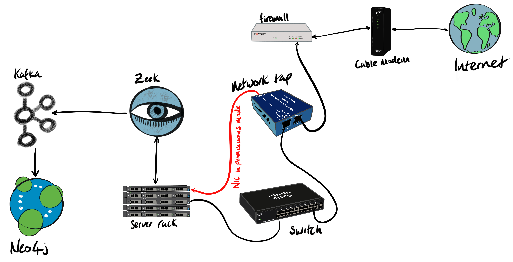
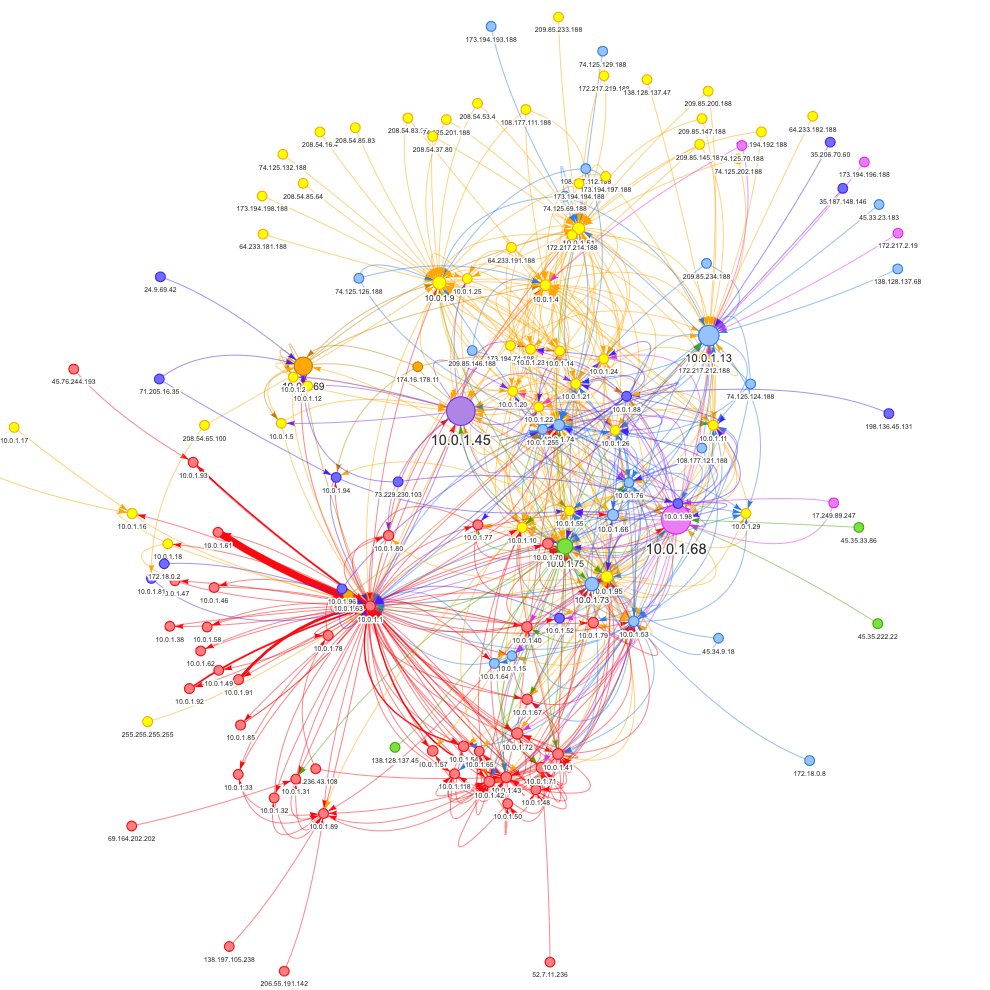

Intrusion detection systems (IDS) passively listen to network traffic via a [network TAP](https://en.wikipedia.org/wiki/Network_tap) or [mirrored port](https://en.wikipedia.org/wiki/Port_mirroring) in order to detect malicious activity or policy violations. Network metadata from the IDS is ingested into a security information and event management (SIEM) system, which is typically monitored by security analysts.

In my case, I placed a [Dualcomm ETAP-2003](https://www.amazon.com/Dualcomm-1000Base-T-Gigabit-Ethernet-Network/dp/B004EWVFAY) inline to send packets directly to a network port that's listening in [promiscuous mode](https://en.wikipedia.org/wiki/Promiscuous_mode). Then [Zeek](https://www.zeek.org/), an open-source network intrusion detection system, extracts metadata from those network packets and publishes that metadata in JSON format to [Apache Kafka](https://kafka.apache.org/). Zeek's protocol analyzers extract around 400 fields from 35 protocols.

The diagram shows how the various components are physically and logically connected.

 

In addition to extracting a plethora of metadata from network packets, Zeek can also publish data directly to Kafka via the [Metron Bro Kafka plugin](https://github.com/apache/metron-bro-plugin-kafka). Once the plugin has been installed, network metadata can be published to Kafka using the following configuration in the Zeek configuration file (located in `/opt/zeek/share/site/local.zeek`):

    @load packages/metron-bro-plugin-kafka
    redef Kafka::send_all_active_logs = T;
    redef Kafka::topic_name = "";
    redef Kafka::kafka_conf = table(
        ["metadata.broker.list"] = "cp01.woolford.io:9092,…”
    );

Note that the `topic_name` property is an empty string. With this setting, each log type will be written to its own topic. For a complete list, check out the Zeek [log files documentation](https://docs.zeek.org/en/stable/script-reference/log-files.html).

Once the data has been landed in Kafka, it's relatively simple to integrate with other systems via the [Confluent Hub](https://www.confluent.io/hub) ecosystem, streaming GUI tools (e.g. [StreamSets](https://streamsets.com/connectors), [Nifi](https://nifi.apache.org), etc...), and streaming frameworks (e.g. [Spark](https://spark.apache.org), [Flink](https://flink.apache.org), [Beam](https://beam.apache.org), etc...). At the time of writing, the Confluent Hub has over 100 connectors that can write to all sorts of databases (including SQL, columnar, document, cache, timeseries, GPU), change data capture tools (CDC), messaging systems, and file/storage technologies.

[Elastic](https://www.elastic.co/products/elasticsearch) is a very popular destination for cybersecurity logs, mainly for its powerful search capabilities that enable threat-monitoring and threat-hunting.
 Out of the box, Zeek's timestamp format isn't recognised by Elastic. The following setting changed the timestamp format to Elastic-friendly epoch millis:

    redef Kafka::json_timestamps = JSON::TS_MILLIS;

[Apache Avro](https://avro.apache.org/) is a common data serialization format that has several advantages over JSON: most notably Avro has a compact format and supports schema management/evolution. By default, Zeek outputs some of the data with periods in the field names. This isn't compatible with Avro. The following property replaces periods with Avro-friendly underscores:

    redef Log::default_scope_sep = "_";

Here are a few of the more interesting Zeek log topics:

* `conn`: TCP/UDP/ICMP connections between hosts
* `dns`: DNS activity
* `ssh`: SSH connections
* `ssl`: SSL/TLS handshake info
* `files`: analysis of files
* `x509`: x509 certificate info
* `software`: software being used on the network

In this article, we'll show you how to analyze that network data in a [graph database](https://en.wikipedia.org/wiki/Graph_database), specifically [Neo4j](https://neo4j.com/). It seems natural to model a network as a graph since a network _is_ a graph of nodes (hosts) and edges (connections).

Neo4j is a graph database that, in addition to having a very intuitive query language ([Cypher](https://neo4j.com/developer/cypher-query-language/)), has bi-directional Kafka connectivity. It really couldn't be much simpler. To build the real-time graph of network connectivity, we downloaded the latest [neo4j-streams](https://github.com/neo4j-contrib/neo4j-streams), copied it to Neo4j's plugins folder, added some properties to `neo4j.conf`, and restarted the service. 

    # Connect to Kafka
    kafka.zookeeper.connect=zk01.woolford.io:2181,zk02.woolford.io:2181,zk03.woolford.io:2181
    kafka.bootstrap.servers=cp01.woolford.io:9092,cp02.woolford.io:9092,cp03.woolford.io:9092
    kafka.auto.offset.reset=latest
    kafka.group.id=neo4j
    kafka.enable.auto.commit=true
    kafka.key.deserializer=org.apache.kafka.common.serialization.ByteArrayDeserializer
    kafka.value.deserializer=org.apache.kafka.common.serialization.ByteArrayDeserializer

    # Cypher query to build graph
    streams.sink.enabled=true
    streams.sink.topic.cypher.conn=MERGE (origin:IP {id: event.id_orig_h}) MERGE (response:IP {id: event.id_resp_h}) MERGE (origin)-[connectedTo:CONNECTED_TO]->(response) ON CREATE SET connectedTo.connections = 1 ON MATCH SET connectedTo.connections = connectedTo.connections + 1 ON CREATE SET origin.orig_bytes = event.orig_bytes ON MATCH SET origin.orig_bytes = origin.orig_bytes + event.orig_bytes ON CREATE SET response.resp_bytes = event.resp_bytes ON MATCH SET response.resp_bytes = response.resp_bytes + event.resp_bytes
    
We used the Zeek `conn` log topic. Here's a sample record:

    {
      "ts": 1576218810003,
      "uid": "CCbJfY2T52zPUgmtJg",
      "id_orig_h": "10.0.1.10",
      "id_orig_p": 36070,
      "id_resp_h": "104.18.2.30",
      "id_resp_p": 80,
      "proto": "tcp",
      "service": "http",
      "duration": 0.054221153259277344,
      "orig_bytes": 271,
      "resp_bytes": 6156,
      "conn_state": "RSTO",
      "local_orig": true,
      "local_resp": false,
      "missed_bytes": 0,
      "history": "ShADadR",
      "orig_pkts": 7,
      "orig_ip_bytes": 571,
      "resp_pkts": 8,
      "resp_ip_bytes": 6488,
      "resp_cc": "US",
      "resp_lat": 37.751,
      "resp_long": -97.822
    }

The `id_orig_h` is the IP address of the originating endpoint, and `id_resp_h` is the IP address of the responding endpoint. For field definitions see this [cheat sheet](http://gauss.ececs.uc.edu/Courses/c6055/pdf/bro_log_vars.pdf).

So now we understand the data, let's take a look at the Cypher query that builds the graph in more detail:

 

We've added some color coding to help make the Cypher statement easier to understand. The `merge` is an upsert for a node in the graph. Each event, highlighted in pink, is set as a property to the nodes in the Cypher statement. Attributes of the event can be accessed with a period (i.e. `.`). For example, `event.id_orig_h` is the originating IP address of that event. We assign properties from the event to the `origin` and `response` nodes, and then create a directional relationship between those nodes. In addition to defining the nodes/edges, we captured counts for each connection and a sum of the bytes sent from each origin.

Neo4j has a (large) number of [graph algorithms](https://neo4j.com/docs/graph-algorithms/current/) to help make sense of the data. We downloaded the latest Neo4j graph algorithms jar from the [the Neo4j download center](https://neo4j.com/download-center/), copied it into the plugins folder, and added the following line to `neo4j.conf`:

    dbms.security.procedures.unrestricted=algo.*

Once Neo4j had been restarted, we were able to add two additional attributes to the graph:

    # add degree of centrality
    CALL algo.degree("IP", "CONNECTED_TO", {direction: "both", writeProperty: "degree"})
    
    # add Louvain community
    CALL algo.louvain("IP", "CONNECTED_TO", {write:true, writeProperty: "community"})

The degree of [centrality](https://en.wikipedia.org/wiki/Centrality) is a measure of the number of edges connected to a given node. This enables us to identify hosts that are talking to a lot of devices on the network. On my network, these are hosts with heavy internet use.

The [Louvain](https://en.wikipedia.org/wiki/Louvain_modularity) community detection algorithm groups similar nodes together. After the Louvain community detection algorithm has been run, each node has a community ID property added to it. The visualization below shows the graph of connections to hosts on my local network and the color represents the community.

 

The Neo4j Browser works really well for small datasets (i.e. < 300 nodes). For larger graphs, it's necessary to visualize using something else. This visualization was created with [Neovis.js](https://github.com/neo4j-contrib/neovis.js/).

Here's the HTML for the Neovis visualization:

    <!doctype html>
    <html>
    <head>
        <title>Zeek connections</title>
        
    
        <!-- FIXME: load from dist -->
        <!--  -->
        
    
        
    
        
    </head>
    <body onload="draw()">
    

    
    Cypher query: <textarea rows="4" cols=50 id="cypher"></textarea> 
    <input type="submit" value="Submit" id="reload">
    <input type="submit" value="Stabilize" id="stabilize">
    
    </body>
    
    
    </html>

Graph analysis is a very powerful technique for a cybersecurity analyst to understand what's happening on the network.

This worked really well in my local network. In high-throughput environment, we'd recommend that you pre-aggregate events before writing them to Neo4j. This would be simple to do in [KSQLdb](https://ksqldb.io/) or Kafka Streams.
 
Here's a video walk-through of the end-to-end solution:

