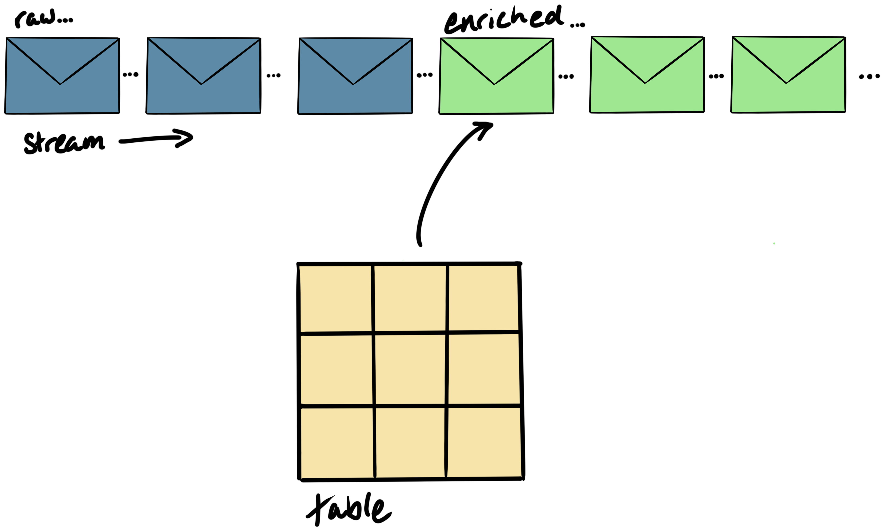
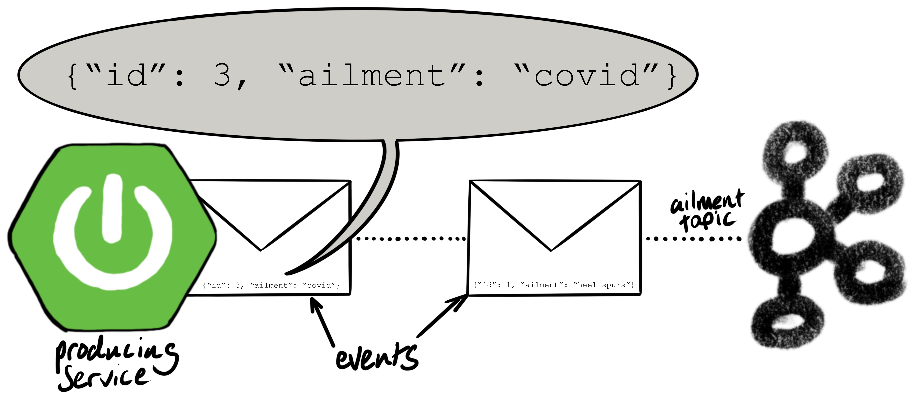
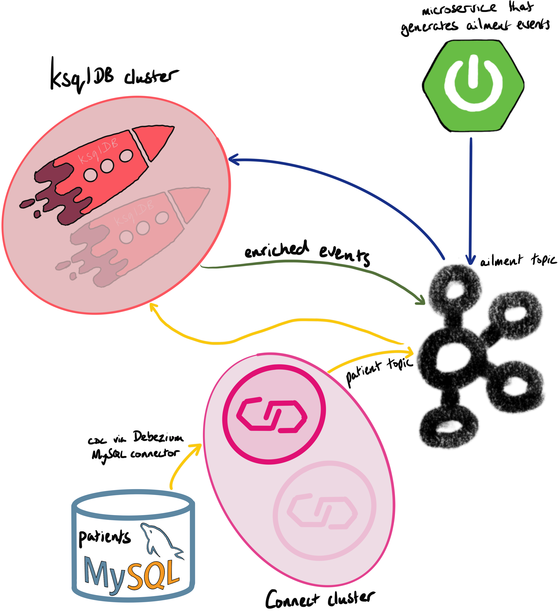

It's very common to enrich a stream of events from data in a relational database. When there are relatively few events and no tight latency requirements, we could simply query the relational database for each record.

With a high volume of events, it's better if the lookup data is cached at the stream of events.

In this article, we'll show you how to perform a stream/table join where the lookup data is sourced from a relational database: MySQL. This is illustrated in the diagram below: the raw events (blue), when enriched by the lookup table (yellow), produce enriched events (green).

 

The source code for this example is available in this Github repo: [confluent-healthcare-coverage-demo](https://github.com/alexwoolford/confluent-healthcare-coverage-demo).

We wrote a Java Spring app that generates ailments and writes them to a Kafka topic. An ailment is a JSON record that contains a patient ID and an ailment (e.g. covid, heel-spurs, chronic xenophobia, etc...).

Here's output from the Kafka console consumer showing the messages from the `ailment` topic:

    [root@cp01 ~]# kafka-console-consumer --bootstrap-server cp01.woolford.io:9092 --topic ailment --property print.key=true
    1   {"id":1,"ailment":"heel spurs"}
    2   {"id":2,"ailment":"covid"}
    5   {"id":5,"ailment":"chronic xenophobia"}
    1   {"id":1,"ailment":"mythomania"}
    3   {"id":3,"ailment":"diabetes"}
    7   {"id":7,"ailment":"ischemic heart disease"}
    7   {"id":7,"ailment":"androgenetic alopecia"}
    1   {"id":1,"ailment":"chronic xenophobia"}
    3   {"id":3,"ailment":"schizoaffective disorder"}
    ^CProcessed a total of 9 messages

The `id` is a unique identifier for the patient. The patients and ailments are generated from data that's staged in MySQL. The tables are automatically created, using Flyway, when the Java Spring app is launched.

Once the ailment data is flowing in Kafka, we create a stream in ksqlDB:

    CREATE STREAM AILMENT (
      id STRING,
      ailment VARCHAR
    ) WITH (
      kafka_topic='ailment',
      value_format='JSON',
      KEY='id'
    );

The ksqlDB stream is backed by the `ailment` topic. The `id` field is used as a key so it can be joined with the lookup table.

The application creates tables in a MySQL database. The [MySQL Debezium connector](https://debezium.io/documentation/reference/1.2/connectors/mysql.html) is used to capture the changes from the MySQL binlogs and write them to a Kafka topic. Here's the config:

    http PUT http://cp01.woolford.io:8083/connectors/mysql-cdc-healthcare/config  <<< '
    {
        "connector.class": "io.debezium.connector.mysql.MySqlConnector",
        "key.converter": "org.apache.kafka.connect.storage.StringConverter",
        "value.converter": "org.apache.kafka.connect.json.JsonConverter",
        "key.converter.schemas.enable": "false",
        "value.converter.schemas.enable": "false",
        "database.history.kafka.bootstrap.servers": "cp01.woolford.io:9092,cp02.woolford.io:9092,cp03.woolford.io:9092",
        "database.history.kafka.topic": "mysql-history",
        "database.hostname": "deepthought.woolford.io",
        "database.password": "V1ctoria",
        "database.port": "3306",
        "database.server.id": "1",
        "database.server.name": "deepthought",
        "database.serverTimezone": "America/Denver",
        "database.user": "root",
        "database.whitelist": "healthcare",
        "include.schema.changes": "false",
        "name": "mysql-cdc-healthcare",
        "snapshot.mode": "when_needed",
        "table.whitelist": "healthcare.patient",
        "tasks.max": "1",
        "transforms": "unwrap,HoistField",
        "transforms.unwrap.type": "io.debezium.transforms.ExtractNewRecordState",
        "transforms.HoistField.type": "org.apache.kafka.connect.transforms.ExtractField$Key",
        "transforms.HoistField.field": "id"
    }'

Let's discuss a couple of noteworthy properties:

1) `"snapshot.mode": "when_needed"`: The MySQL Debezium connector piggybacks on MySQL's replication, which creates a binary log (binlog) of all the changes. To enable the binlog, the following snippet was added to the `[mysqld]` section in `/etc/my.cnf`:

        # settings to create binary logs
        server-id         = 1
        log_bin           = master
        expire_logs_days  = 1
        binlog_format     = row
        binlog-row-image  = full

   By default, the connector performs a bulk export and, once completed, switches to an incremental mode. Ideally, the connector would run forever without incident.
   
   In the event of a connectivity issue that lasts longer than the binlogs, before they're purged, the connector will need to re-snapshot the database. This happens automatically when the snapshot mode is `when_needed`. That's a bit more resilient.
   
2) There are two single-message transforms, `unwrap` and `HoistField`:

    i) `unwrap`: lightweight output (no schema or "before" data in the message).
    
    ii) `HoistField`: from Debezium, the key of a message is a struct containing the primary key. In our table, the primary key is a column called `id`. The key converter returns the `toString()` of the key which might look like this: `Struct{id=1}`. By using the `HoistField` single-message transform, we replace the string representation of the struct with the ID, stored as a string (e.g. `1` instead of `Struct{id=1}`). While it's not essential in order to perform the join in ksqlDB, having identically formatted keys is a good idea.

Here's what we have in MySQL:

    mysql> use healthcare;
    
    Database changed
    mysql> select * from patient;
    +----+-----------+------------+--------------+------------+
    | id | firstname | lastname   | enroll_start | enroll_end |
    +----+-----------+------------+--------------+------------+
    |  1 | Donald    | Trump      | 2019-04-14   | 2020-04-13 |
    |  2 | Vladimir  | Putin      | 2019-05-20   | 2020-05-19 |
    |  3 | Boris     | Johnson    | 2019-01-24   | 2020-01-24 |
    |  4 | Mark      | Zuckerberg | 2019-03-03   | 2020-03-02 |
    |  5 | Benjamin  | Netanyahu  | 2019-08-24   | 2020-08-23 |
    |  6 | Jair      | Bolsonaro  | 2019-09-19   | 2020-09-18 |
    |  7 | Farty     | McFartface | 2019-08-23   | 2020-08-22 |
    +----+-----------+------------+--------------+------------+
    7 rows in set (0.00 sec)

And here's output from the Kafka console consumer showing the messages from the `[host].[db].patient` topic:

    # kafka-console-consumer --bootstrap-server localhost:9092 --topic deepthought.healthcare.patient --property print.key=true
    1	{"id":1,"firstname":"Donald","lastname":"Trump","enroll_start":18198,"enroll_end":18563}
    2	{"id":2,"firstname":"Vladimir","lastname":"Putin","enroll_start":18035,"enroll_end":18400}
    3	{"id":3,"firstname":"Boris","lastname":"Johnson","enroll_start":18048,"enroll_end":18413}
    4	{"id":4,"firstname":"Mark","lastname":"Zuckerberg","enroll_start":18235,"enroll_end":18600}
    5	{"id":5,"firstname":"Benjamin","lastname":"Netanyahu","enroll_start":18038,"enroll_end":18403}
    6	{"id":6,"firstname":"Jair","lastname":"Bolsonaro","enroll_start":17952,"enroll_end":18317}
    7	{"id":7,"firstname":"Farty","lastname":"McFartface","enroll_start":18111,"enroll_end":18476}

Now we have events in both the `ailment` and `patient` topics, we can create a stream and table in ksqlDB. Here's the stream:

    CREATE STREAM AILMENT (
      id STRING,
      ailment VARCHAR
    ) WITH (
      kafka_topic='ailment',
      value_format='JSON',
      KEY='id'
    );

And here's the table:

    CREATE TABLE PATIENT (
      id STRING,
      firstname VARCHAR,
      lastname VARCHAR,
      enroll_start BIGINT,
      enroll_end BIGINT
    ) WITH (
      kafka_topic='[host].[db].patient',
      value_format='JSON',
      KEY='id'
    );

We can then join the stream and table in ksqlDB:

    create stream ailment_patient as select
      ailment.id as id,
      ailment,
      firstname,
      lastname,
      ailment.rowtime as ailment_ts,
      enroll_start * 86400 * 1000 as enroll_start,
      enroll_end * 86400 * 1000 as enroll_end,
      case
        when ailment.rowtime > enroll_start * 86400 * 1000
          and ailment.rowtime <= enroll_end * 86400 * 1000
        then true
        else false
      end as covered
    from ailment inner join patient on ailment.id = patient.id emit changes;

The joined data is written back to a topic, ready for consumption by other connectors, microservices, etc...

Here's a diagram showing the topology:

Note the pairs of Connect and ksqlDB nodes. That's typical for fault-tolerance.
 

Here's a video walk-through:

