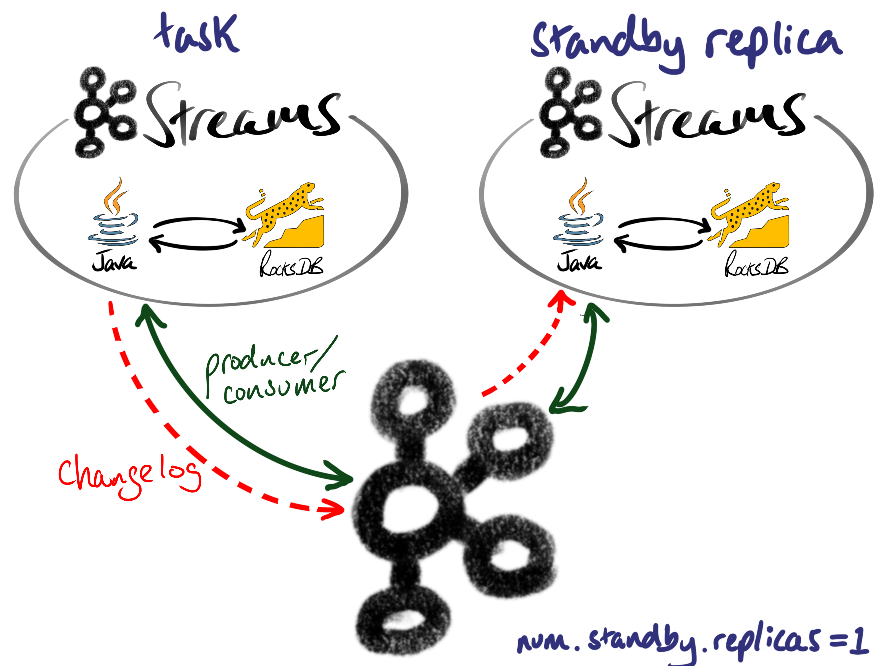
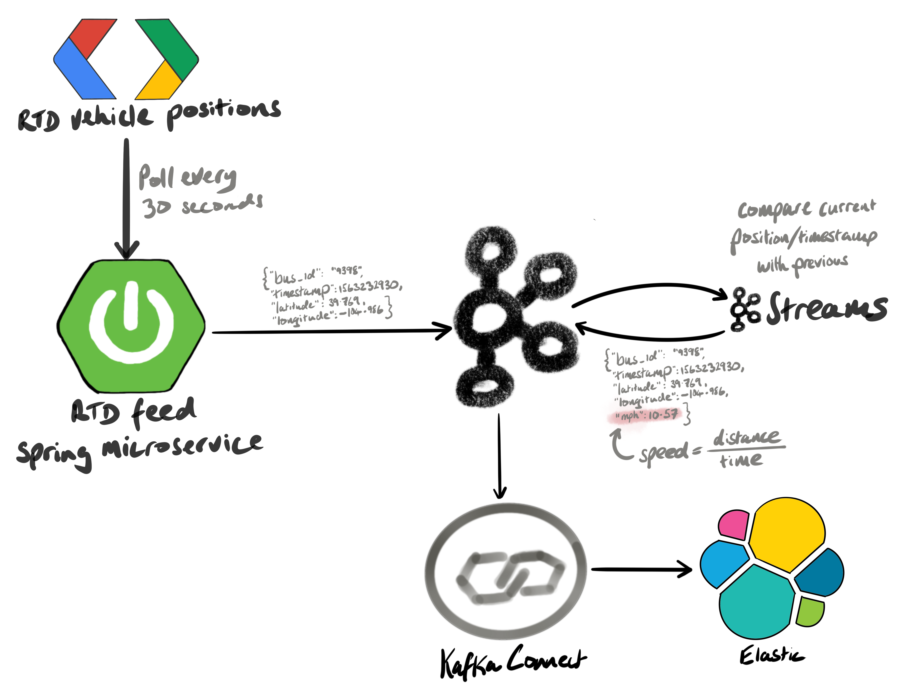

It's commonplace, in a wide variety of streaming use cases, to track changes in values over time. 

Kafka Streams is an abstraction on top of the producer/consumer API that allows developers to build stateful streaming applications. A stateful application has to keep track of properties over time which, in this case, are the position of buses.

While we could simply use the consumer/producer API to read/write from Kafka, and store the store the state in a map, that doesn't handle failures. If we do this, the state is ephemeral and disappears if the application stops for whatever reason.

Another alternative would be to use a streaming framework such as Spark or Flink. These technologies typically run on a dedicated cluster. Depending on the use-case, that could be overly complex and costly.

Under the hood, Kafka Streams caches its state in a local RocksDB instance, and writes the changes back to a Kafka changelog topic. Scale out is possible thanks to Kafka's partitions, and commits are tracked using Kafka's offsets.

In order to minimize recovery time, in the event of failure, we can simply set `num.standby.replicas=1` and Kafka Streams will keep a hot-standby replica ready to take over.

Now let's get back to the transportation example.

Denver's Regional Transportation District ([RTD](https://www.rtd-denver.com/)), the agency that runs public transport in the Front Range, continually publishes a [Protobuf](https://developers.google.com/protocol-buffers) file containing the positions of buses. A Java Spring microservice downloads this file every 30 seconds, parses the Protobuf messages, and publishes all the bus positions to Kafka every 30 seconds. The messages are serialized as Avro and look like this:

    {
      "id": "5914",
      "timestamp": 1574904869,
      "location": {
        "lon": -104.98970794677734,
        "lat": 39.697723388671875
      }
    }

A Kafka Streams job then consumes the bus positions, and calculates the average speed since the last known position. In order to calculate the speed, we need two positions with timestamps.

There's a famous formula called the [Haversine formula](https://en.wikipedia.org/wiki/Haversine_formula), that calculates the distance between two sets of coordinates. If we know the current position, and the previous position, we can calculate the distance. And if we know the distance, and how long it took to travel that distance, we can calculate the speed (since speed=distance/time).

Here's a sample output message that contains the speed:

    {
      "id": "5914",
      "timestamp": 1574904869,
      "location": {
        "lon": -104.98970794677734,
        "lat": 39.697723388671875
      },
      "milesPerHour": 34.18513011763098,
      "h3": "8c268cd8d171dff"
    }

 

Note that the milesPerHour and h3 properties have been added. The h3 is a hierarchical spatial index, designed by Uber. See [eng.uber.com/h3](https://eng.uber.com/h3/) for more details. The h3 is at resolution 12 - which equates to hexagons that are approx. 307 square meters. The H3 index was added to identify anomalies: we can later calculate a distribution of values within each h3 hexagon, and use that distribution to identify speeding vehicles.

I've always been fascinated to see how we can derive insights by tracking changes in data. This stateful technique, using Kafka Streams, is applicable to a myriad of use cases. What changes could you track in real-time to make better decisions for your business?

Source code: [rtd-kafka](https://github.com/alexwoolford/rtd-kafka) 

[//]: # (TODO: hexagons to identify speed anomalies - possibly add to streams job)
