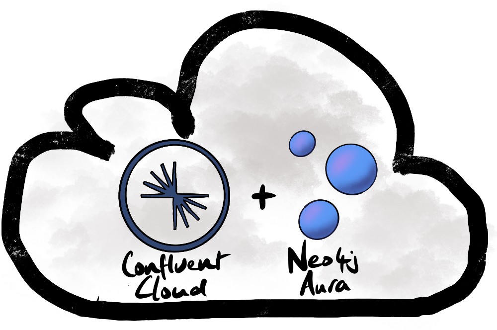

Both Confluent and Neo4j have cloud-native services that save customers a lot of time and money. Increasingly, customers want to unburden themselves from the operations and maintenance of complex software. As a rule of thumb, it makes sense for companies to focus on the things that differentiate them from their competitors.

Managed cloud services, such as Confluent Cloud and Neo4j's Aura can dramatically reduce time-to-market, risk, and the total cost of ownership.

Confluent Cloud has auto-topic creation disabled. In order to produce data, we must first create the topic:

    % ccloud login
    Using environment "t1630" ("woolford").
    % ccloud kafka cluster use lkc-dxgzy
    Set Kafka cluster "lkc-dxgzy" as the active cluster for environment "t1630".
    % ccloud kafka topic create meetup-member-group-topic --partitions 1

The topic was created with a single partition because we're not going to produce a tsunami of data since it's just an example.

We can now publish some records to the topic. The Python script below streams RSVP's from the Meetup RSVP endpoint. You can take a peek at the sample data by opening this url in your browser: https://stream.meetup.com/2/rsvps.

    #!/usr/bin/env python3
    from confluent_kafka import Producer
    import os
    import json
    import datetime
    
    import requests
    
    conf = {'bootstrap.servers': os.getenv('BROKER_ENDPOINT'),
            'security.protocol': 'SASL_SSL',
            'sasl.mechanisms': 'PLAIN',
            'sasl.username': os.getenv('CLUSTER_API_KEY'),
            'sasl.password': os.getenv('CLUSTER_API_SECRET')}
    
    producer = Producer(conf)
    
    end_time = datetime.datetime.now() + datetime.timedelta(seconds=60)
    
    url = 'https://stream.meetup.com/2/rsvps'
    with requests.get(url, stream=True) as r:
        for line in r.iter_lines():
    
            if datetime.datetime.now() >= end_time:
                break
    
            if line:
                meetup = json.loads(line)
    
                member_id = meetup.get('member').get('member_id')
                time = meetup.get('event').get('time')
    
                group_topics = meetup.get('group').get('group_topics')
    
                for group_topic in group_topics:
                    group_topic_name = group_topic.get('topic_name')
                    record = {'member_id': member_id, 'time': time, 'group_topic_name': group_topic_name}
                    producer.produce('meetup-member-group-topic', json.dumps(record))
                    producer.flush()

The stream of events in Confluent Cloud looks like this:

    % ccloud kafka topic consume meetup-member-group-topic --from-beginning
    Starting Kafka Consumer. ^C or ^D to exit
    {"member_id": 324900133, "time": 1627200000000, "group_topic_name": "Camping"}
    {"member_id": 324900133, "time": 1627200000000, "group_topic_name": "Rock Climbing"}
    {"member_id": 324900133, "time": 1627200000000, "group_topic_name": "New In Town"}
    {"member_id": 324900133, "time": 1627200000000, "group_topic_name": "Exercise"}
    {"member_id": 324900133, "time": 1627200000000, "group_topic_name": "Travel"}
    {"member_id": 324900133, "time": 1627200000000, "group_topic_name": "Backpacking"}
    ...
    {"member_id": 220950091, "time": 1622851200000, "group_topic_name": "Lean Startup"}
    {"member_id": 220950091, "time": 1622851200000, "group_topic_name": "Internet Professionals"}
    {"member_id": 220950091, "time": 1622851200000, "group_topic_name": "Technology Startups"}
    {"member_id": 220950091, "time": 1622851200000, "group_topic_name": "Venture Capital"}
    {"member_id": 220950091, "time": 1622851200000, "group_topic_name": "Small Business"}
    {"member_id": 220950091, "time": 1622851200000, "group_topic_name": "Web Technology"}
    ...

This sample data shows member/group relationships for a couple of RSVP's.

At the time of writing (2021-05-24) there are approx. 200 connectors available in [Confluent Hub](https://www.confluent.io/hub/). We're going to write this data into a graph that's hosted on Neo4j's managed cloud service, [Aura](https://neo4j.com/cloud/aura/).

Now that the data is being streamed into Confluent Cloud, we can setup the Dockerized Connect instance. The connectors themselves aren't included in the [confluentinc/cp-kafka-connect](https://hub.docker.com/r/confluentinc/cp-kafka-connect) image. We need to create a custom Docker container that contains the Neo4j sink connector. First, create a Dockerfile that takes the base image and installs the Neo4j sink connector:

    % cat Dockerfile 
    FROM confluentinc/cp-kafka-connect:6.1.1
    RUN confluent-hub install --no-prompt neo4j/kafka-connect-neo4j:1.0.9

We build the image using the Docker build command:

    docker build . -t ccloud-neo4j:1.0.0

For more details, read [Confluent extending images](https://docs.confluent.io/platform/current/installation/docker/development.html#extending-images) docs.

Once the Docker image has been built, you can see it in the list of local images:

    % docker image list
    REPOSITORY                          TAG     IMAGE ID       CREATED      SIZE
    ccloud-neo4j                        1.0.0   59fd3261daa4   1 hour ago   1.28GB
    confluentinc/cp-kafka-connect-base  6.1.1   c6ffc0a95eda   3 weeks ago  1.25GB
    ...

In order to run our customized Connect instance, we need:

* bootstrap url
* API key
* API secret

These can be obtained from the Confluent Cloud UI or via the CLI. We plug these values into the docker run command, e.g.

    docker run -d \
      --name=kafka-connect \
      -p 8083:8083 \
      -e CONNECT_BOOTSTRAP_SERVERS="[*** BOOTSTRAP URL ***]" \
      -e CONNECT_GROUP_ID="ccloud-docker-connect" \
      -e CONNECT_CONFIG_STORAGE_TOPIC="connect-config" \
      -e CONNECT_OFFSET_STORAGE_TOPIC="connect-offsets" \
      -e CONNECT_STATUS_STORAGE_TOPIC="connect-status" \
      -e CONNECT_KEY_CONVERTER="org.apache.kafka.connect.json.JsonConverter" \
      -e CONNECT_VALUE_CONVERTER="org.apache.kafka.connect.json.JsonConverter" \
      -e CONNECT_INTERNAL_KEY_CONVERTER="org.apache.kafka.connect.json.JsonConverter" \
      -e CONNECT_INTERNAL_VALUE_CONVERTER="org.apache.kafka.connect.json.JsonConverter" \
      -e CONNECT_REST_ADVERTISED_HOST_NAME="localhost" \
      -e CONNECT_PLUGIN_PATH=/usr/share/confluent-hub-components \
      -e CONNECT_REST_PORT=8083 \
      -e CONNECT_REST_ADVERTISED_HOST_NAME="localhost" \
      -e CONNECT_SSL_ENDPOINT_IDENTIFICATION_ALGORITHM="https" \
      -e CONNECT_SASL_MECHANISM="PLAIN" \
      -e CONNECT_REQUEST_TIMEOUT_MS="20000" \
      -e CONNECT_RETRY_BACKOFF_MS="500" \
      -e CONNECT_SECURITY_PROTOCOL="SASL_SSL" \
      -e CONNECT_CONSUMER_SSL_ENDPOINT_IDENTIFICATION_ALGORITHM="https" \
      -e CONNECT_CONSUMER_SASL_MECHANISM="PLAIN" \
      -e CONNECT_CONSUMER_REQUEST_TIMEOUT_MS="20000" \
      -e CONNECT_CONSUMER_RETRY_BACKOFF_MS="500" \
      -e CONNECT_CONSUMER_SECURITY_PROTOCOL="SASL_SSL" \
      -e CONNECT_SASL_JAAS_CONFIG="org.apache.kafka.common.security.plain.PlainLoginModule required username=\"[*** API key ***]\" password=\"[*** API secret ***]\";" \
      -e CONNECT_CONSUMER_SASL_JAAS_CONFIG="org.apache.kafka.common.security.plain.PlainLoginModule required username=\"[*** API key ***]\" password=\"[*** API secret ***]\";" \
      -e CONNECT_CONNECTOR_CLIENT_CONFIG_OVERRIDE_POLICY="All" \
      -e CONNECT_LOG4J_ROOT_LOGLEVEL=INFO \
      ccloud-neo4j:1.0.0

If you managed not to make any typos/errors, you'll be able interact with the Dockerized instance using the [REST API](https://docs.confluent.io/platform/current/connect/references/restapi.html). I'd recommend making calls with [httpie](https://httpie.io/). It's a bit more elegant than `curl`. We can confirm that the Neo4j sink connector has been installed:

    % http localhost:8083/connector-plugins/
    [
        ....,
        {
            "class": "streams.kafka.connect.sink.Neo4jSinkConnector",
            "type": "sink",
            "version": "1.0.9"
        }
    ]

Hopefully everything went smoothly, and it won't be necessary to go fishing through the logs. If you do need to view the logs, get the container ID:

    % docker ps
    CONTAINER ID   IMAGE                COMMAND                  CREATED         STATUS                   PORTS                                                 NAMES
    01f3cf781c79   ccloud-neo4j:1.0.0   "/etc/confluent/dock…"   4 minutes ago   Up 4 minutes (healthy)   0.0.0.0:8083->8083/tcp, :::8083->8083/tcp, 9092/tcp   kafka-connect

Once you have the container ID, you can tail the logs and look for errors:

    docker logs -f 01f3cf781c79

If something did go wrong, it's probably a typo in the `docker run` command.

Now login to [Neo4j's Aura console](https://console.neo4j.io/#/) and create a database. You'll get a connection URI, a username, and a password. Make a note of these. We'll need them to configure the connector.

Create a constraint so there can only be one node per `member_id`:

    CREATE CONSTRAINT member_id_idx IF NOT EXISTS
    ON (m:MemberId)
    ASSERT m.member_id IS UNIQUE

Similarly, create a constraint so there can only be one node per `group_topic_name`:

    CREATE CONSTRAINT group_topic_name_idx IF NOT EXISTS
    ON (g:GroupTopicName)
    ASSERT g.group_topic_name IS UNIQUE

Now let's craft a Cypher statement to build the graph. Each event looks like this:

    {"member_id": 220950091, "time": 1622851200000, "group_topic_name": "Lean Startup"}

The Cypher statement creates MemberId and GroupTopicName nodes, if they don't exist, and creates an `RSVP` relationship between them, e.g.

    MERGE(m:MemberId {member_id: '220950091'})
    MERGE(g:GroupTopicName {group_topic_name: 'Lean Startup'})
    MERGE(m)-[:RSVP {time: 1622851200000}]->(g)

Once we've confirmed that the Cypher statement creates the nodes and relationship as expected, we can plug it into the connector configuration. 

    http PUT localhost:8083/connectors/meetup-neo4j/config <<< '
    {
        "connector.class": "streams.kafka.connect.sink.Neo4jSinkConnector",
        "key.converter": "org.apache.kafka.connect.storage.StringConverter",
        "name": "meetup-neo4j",
        "neo4j.server.uri": "neo4j+s://a806547a.databases.neo4j.io:7687",
        "neo4j.authentication.basic.username": "neo4j",
        "neo4j.authentication.basic.password": "[*** Neo4j password ***]",
        "neo4j.topic.cypher.meetup-member-group-topic": "MERGE(m:MemberId {member_id: event.member_id}) MERGE(g:GroupTopicName {group_topic_name: event.group_topic_name}) MERGE(m)-[:RSVP {time: event.time}]->(g)",
        "topics": "meetup-member-group-topic",
        "value.converter": "org.apache.kafka.connect.json.JsonConverter",
        "value.converter.schemas.enable": "false"
    }'

There are a couple of potential "gotchas" worth noting:

1) append the Bolt port number (`7687`) to the `neo4j.server.uri`
2) append the topic name at the end of the `neo4j.topic.cypher.` property

We can confirm that the connector is running via the `status` endpoint in the Dockerized Connect instance:

    % http localhost:8083/connectors/meetup-neo4j/status
    {
        "connector": {
            "state": "RUNNING",
            "worker_id": "localhost:8083"
        },
        "name": "meetup-neo4j",
        "tasks": [
            {
                "id": 0,
                "state": "RUNNING",
                "worker_id": "localhost:8083"
            }
        ],
        "type": "sink"
    }

Now that the data is in Neo4j, we can query the graph. For example, people who RSVP'd to a Meetup that mentioned canoeing, also tended to RSVP to Meetups about the outdoors, kayaking, hiking, etc...

    MATCH(g1:GroupTopicName {group_topic_name: 'Canoeing'})<-[:RSVP]-(m:MemberId)-[:RSVP]->(g2:GroupTopicName)
    WHERE g1.group_topic_name <> g2.group_topic_name
    RETURN g2.group_topic_name AS group_topic_name, COUNT(*) AS count
    ORDER BY count DESC
    LIMIT 4

    ╒══════════════════╤═══════╕
    │"group_topic_name"│"count"│
    ╞══════════════════╪═══════╡
    │"Outdoors"        │6      │
    ├──────────────────┼───────┤
    │"Kayaking"        │5      │
    ├──────────────────┼───────┤
    │"Hiking"          │4      │
    ├──────────────────┼───────┤
    │"Adventure"       │3      │
    └──────────────────┴───────┘

The main purpose of this article was to show how we can stream events from Confluent Cloud into Neo4j Aura. I'm hopeful that this will serve as a customizable recipe.
