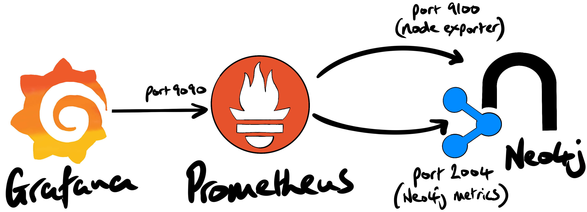

[Prometheus](https://prometheus.io/) is a popular open-source monitoring system and timeseries database. One of the main architectural advantages of Prometheus is that it (typically) scrapes metrics from the systems it's monitoring. It's a _pull_ system. This is more robust and flexible than, say, telemetry ingest where clients/services _push_ data to a RESTful endpoint.

Neo4j Enterprise has a built-in Prometheus endpoint that can be enabled by setting a couple of properties in `neo4j.conf`.

In this article we'll walk-through the setup of Prometheus to capture metrics from a Neo4j database, and the host it's running on. We'll also setup Grafana in order to visualize some of those metrics in a dashboard.

A compelling reason to use Prometheus/Grafana is that the Neo4j database doesn't exist in isolation. Various applications might read from and write to the Neo4j database. And the database itself runs on a Linux host, which provides CPU, RAM, disk, etc. From a dev-ops perspective, it's important that we can correlate events across systems.

In addition, a production system will integrate with an incident management service such as [PagerDuty](https://www.pagerduty.com/), [VictorOps](https://victorops.com/), or [OpsGenie](https://www.atlassian.com/software/opsgenie). Prometheus has integrations with these solutions.

If alerting isn't a requirement, and we only want to visibility to Neo4j's internals, [Halin](https://neo4j.com/labs/halin/) would be a much better fit.

## prepare the Prometheus host

Neo4j was deployed on an AWS EC2 instance in the `us-west-1` region. Although AWS has both Prometheus and Grafana services, they were not available in that region at the time of writing (2021-06-04).

We spun-up a `t2.large` instance (2 vCPU's; 8GB of RAM) to host Prometheus and Grafana. We added a 100GB EBS volume for the Prometheus database data. It's important that the Prometheus timeseries database has enough storage.

For convenience, we added the following properties to our local `~/.ssh.config` file:

    Host woolford-prometheus
      HostName 52.52.149.133
      User ec2-user
      IdentityFile /Users/alexwoolford/.ssh/awoolford_neo4j_west.pem

This allows us to connect to the Prometheus host without the need to specify the IP address, username, and PEM key. This allowed us to login to the instance with a simple `ssh woolford-prometheus`.

First, we ran the `lsblk` command to determine the name of the EBS device (i.e. `xvdb`):

    #  lsblk
    NAME    MAJ:MIN RM  SIZE RO TYPE MOUNTPOINT
    xvda    202:0    0    8G  0 disk 
    └─xvda1 202:1    0    8G  0 part /
    xvdb    202:16   0  100G  0 disk 

We then created an xfs filesystem on that storage device:

    # mkfs.xfs /dev/xvdb

By default, Prometheus stores its timeseries database in `/var/lib/prometheus`. We created that mount point:

    # mkdir /var/lib/prometheus

To permanently mount the 100GB EBS volume to `/var/lib/prometheus`, we added an entry to `/etc/fstab`. To create that entry, we first had to get the UUID (universally unique identifier) for the `xvdb` block device: 

    # blkid
    /dev/xvda1: LABEL="/" UUID="7b355c6b-f82b-4810-94b9-4f3af651f629" TYPE="xfs" PARTLABEL="Linux" PARTUUID="a5dcc974-1013-4ea3-9942-1ac147266613"
    /dev/xvdb: UUID="82e76047-f822-4333-961e-67826af34721" TYPE="xfs"

This device was permanently mounted to `/var/lib/prometheus` by adding the following line to `/etc/fstab`:

    UUID=82e76047-f822-4333-961e-67826af34721  /var/lib/prometheus  xfs  defaults,nofail  0  2

We rebooted the instance and confirmed that the 100GB drive had been mounted:

    $ df -h
    Filesystem      Size  Used Avail Use% Mounted on
    ...
    /dev/xvda1      8.0G  1.6G  6.5G  20% /
    /dev/xvdb       100G  135M  100G   1% /var/lib/prometheus

## Ansible setup

[Cloud Alchemy](https://github.com/cloudalchemy) has made production-grade Prometheus/Grafana setup very simple, via Ansible. We first install Cloud Alchemy's Ansible roles for Prometheus, the [Prometheus Node Exporter](https://github.com/prometheus/node_exporter), and Grafana on the deployment host (i.e. my laptop):

    ansible-galaxy install cloudalchemy.prometheus
    ansible-galaxy install cloudalchemy.node_exporter
    ansible-galaxy install cloudalchemy.grafana

We added the Neo4j and Prometheus hosts to the local Ansible inventory by adding a group called `woolford` in our `/etc/ansible/hosts` file:

    all:
        ...
        woolford:
          hosts:
            woolford-prometheus:
            woolford-neo4j:

We then confirmed Ansible connectivity using the Ansible `ping` module:

    % ansible woolford -m ping
    woolford-prometheus | SUCCESS => {
        "ansible_facts": {
            "discovered_interpreter_python": "/usr/bin/python"
        },
        "changed": false,
        "ping": "pong"
    }
    woolford-neo4j | SUCCESS => {
        "ansible_facts": {
            "discovered_interpreter_python": "/usr/bin/python"
        },
        "changed": false,
        "ping": "pong"
    }

Both hosts responded with a "pong". That's good.

# enable the Neo4j Prometheus endpoint

Neo4j Enterprise has built-in Prometheus endpoint that be enabled by adding the following properties to `neo4j.conf`.

    metrics.prometheus.enabled=true
    metrics.prometheus.endpoint=0.0.0.0:2004

The `neo4j` service was restarted. We confirmed that endpoint was accessible from the Prometheus host using (httpie)[https://httpie.io/]:

    $ http 172.31.5.57:2004/metrics

    neo4j_system_check_point_total_time_total 0.0
    neo4j_bolt_connections_opened_total 0.0
    ...

Pro-tip: if you use `curl`, consider using httpie instead.

# install the Prometheus Node Exporter

The Prometheus [Node Exporter](https://prometheus.io/docs/guides/node-exporter/) exposes hardware and kernel metrics from the host. The Ansible-based installation is far less error-prone than completing all the steps by-hand.

To install the node exporter Neo4j host we created an Ansible playbook, `prometheus-node-exporter-install.yml` containing the following YAML:

    - hosts: woolford-neo4j
      roles:
        - cloudalchemy.node_exporter

When we first attempted to install the Node Exporter, we ran into an issue where "Python quit unexpectedly." A quick Google search suggested that we set the following environment variable before running the playbooks:

    export OBJC_DISABLE_INITIALIZE_FORK_SAFETY=YES

We added this one-liner to `~/.zshrc` so this environment variable is always set when running CLI commands.

We then ran the playbook:

    ansible-playbook prometheus-node-exporter-install.yml

The installation was successful. We confirmed that the node exporter was working by making an HTTP call to the endpoint on the Neo4j host (port 9100):

    $ http 172.31.5.57:9100/metrics
    node_disk_io_now{device="nvme0n1"} 0
    node_disk_io_time_seconds_total{device="nvme0n1"} 7672.7
    node_disk_read_bytes_total{device="nvme0n1"} 9.12474983424e+11
    ...

Now that there are a couple of metric-producing endpoints to scrape, we installed Prometheus. Like we did with the Node Exporter installation, we created an Ansible playbook, `prometheus-install.yml`, containing the following:

    - hosts: woolford-prometheus
      roles:
        - cloudalchemy.prometheus
      vars:
        prometheus_targets:
          node:
          - targets:
            - 172.31.5.57:9100
            - 172.31.5.57:2004
            labels:
              env: woolford-neo4j

Note that we specify the target endpoints in the Neo4j instance. We used the internal IP address of the Neo4j instance to avoid unnecessary ingress/egress charges since both the Neo4j instance and Prometheus reside in the same VPC.

We then ran the playbook:

    ansible-playbook prometheus-install.yml

In order to connect to Prometheus from outside the VPC, it was necessary to create an inbound rule from our IP to port 9090. Once we created that rule, we could access the [somewhat limited] Prometheus GUI and view the metrics from the Neo4j host.
 
## install Grafana

We then installed Grafana using an Ansible playbook, `grafana-install.yml`:

    - hosts: woolford-prometheus
      roles:
        - role: cloudalchemy.grafana
          vars:
            grafana_security:
              admin_user: neo4j
              admin_password: neo4j

We ran that playbook:

    ansible-playbook install-grafana.yml

In order to access Grafana, we added another inbound rule to the security group so that our IP could access port 3000 of the Prometheus host.

We added our Prometheus host as a datasource in Grafana. This allowed us to create a near real-time dashboard containing metrics from Neo4j and the host operating system.

## ... in closing

Prometheus is a powerful monitoring solution that can capture metrics from various systems, e.g. databases, messaging, storage, API's (see the Prometheus [exporters and integrations](https://prometheus.io/docs/instrumenting/exporters/) page for a complete list). The ability to visually correlate timeseries data is important for engineers who manage solutions that integrate a variety of technologies. Prometheus also provides an easy integration point for incident management services (e.g. PagerDuty, VictorOps, OpsGenie, etc.) which is considered a table stake for complex production environments.

If you're not already using Prometheus, it's extremely robust and simple to setup with Ansible. Neo4j Enterprise's built-in endpoint makes it a breeze to start capturing those metrics.
